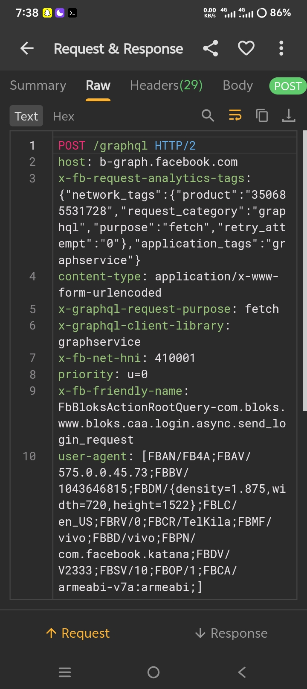

🧬⚡ FACEBOOK NATIVE SSL RESEARCH ⚡🧬

👨‍💻 Muhammad Hamza • Android Native Security Lab

  

---

🧠 SYSTEM INFORMATION

╔══════════════════════════════════════════════════════╗
║                 FACEBOOK NATIVE LAB                  ║
╠══════════════════════════════════════════════════════╣
║                                                      ║
║  📦 Package       : com.facebook.katana              ║
║  🏷️ Version       : 575.0.0.45.73                    ║
║  🖥️ Architecture  : ARM64-v8a                        ║
║  ⚙️ Module        : libcoldstart.so                  ║
║  🔗 Interface     : JNI / Native Layer               ║
║  🔐 Security      : SSL / TLS Research               ║
║  📡 Environment   : Controlled Research Lab          ║
║                                                      ║
╚══════════════════════════════════════════════════════╝

---

🧬 JNI NATIVE ARCHITECTURE

                  📱 FACEBOOK ANDROID
                          │
                          ▼
                ┌──────────────────┐
                │   JAVA / KOTLIN  │
                └────────┬─────────┘
                         │
                         ▼
                   🔗 JNI BRIDGE
                         │
                ┌────────┴────────┐
                │                 │
                ▼                 ▼
           JNI_OnLoad()     Native Methods
                │                 │
                └────────┬────────┘
                         ▼
                    ⚙️ C / C++
                         │
                         ▼
                   🖥️ ARM64 CODE
                         │
                         ▼
                  📦 libcoldstart.so
                         │
                         ▼
                    🔐 TLS LAYER

---

🔬 NATIVE BINARY RESEARCH

┌──────────────────────────────────────────────────────┐
│                 libcoldstart.so                      │
├──────────────────────────────────────────────────────┤
│                                                      │
│  📦 ELF Structure                                    │
│  🔗 Dynamic Symbols                                  │
│  🧬 JNI Entry Points                                 │
│  ⚙️ Native Functions                                 │
│  🖥️ ARM64 Instructions                              │
│  🔍 Cross References                                 │
│  🔐 SSL/TLS Components                               │
│  📊 Runtime Behavior                                 │
│                                                      │
└──────────────────────────────────────────────────────┘

---

📡 RESEARCH PIPELINE

        📱 APK
          │
          ▼
   Native Libraries
          │
          ▼
  libcoldstart.so
          │
          ▼
     ELF Analysis
          │
          ▼
     JNI Discovery
          │
          ▼
    ARM64 Analysis
          │
          ▼
   SSL/TLS Research
          │
          ▼
     🧪 LAB RESULTS

---

🛠️ RESEARCH STACK

---

📸 EVIDENCE

  

🔎 Facebook Native / JNI Security Research Evidence

Captured during controlled Android research.

---

🌐 CONTACT PANEL

👨‍💻 MUHAMMAD HAMZA

 📘 FACEBOOK

  

📱 WHATSAPP

---

⚠️ RESPONSIBLE RESEARCH

This project is intended for educational and authorized
security research purposes only.

Testing should be performed only in controlled environments
and on applications, devices and accounts for which you have
explicit permission.

The author is not responsible for unauthorized use.

---

🧬 JNI • ARM64 • ELF • SSL/TLS

🔥 POWERED BY MUHAMMAD HAMZA 🔥

Android Native Security • JNI Research • ARM64 Analysis

